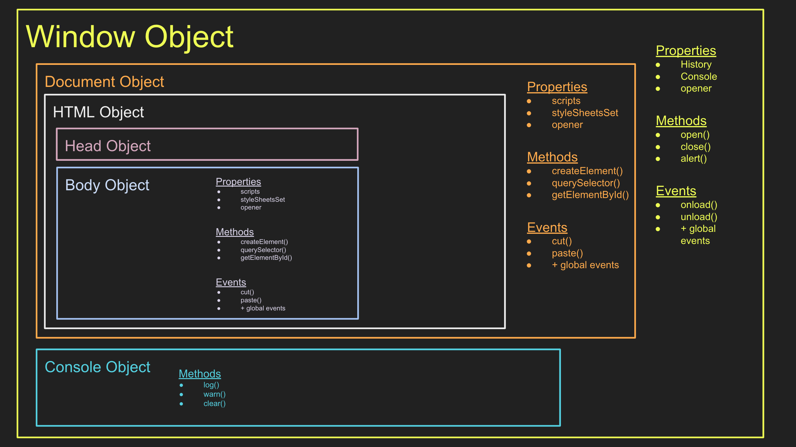

# Pre-Class Lesson 1: TITLE

*“It is always the simple that produces the marvelous.” —Amelia Barr*

## Special Elements like Images

**Mkdocs and Material** along with a nice extension called pym... allow for some serious control over your documentation (learning materials). Here's an example of an image aligned to the right:

{: align=right } see it there?

<!-- {: align=right } See it there? -->

********************
We can add any bit of text we want to make our ebook's flow more interestingly!

Unfortunately you have to have quite a bit to say here otherwise the next sections gets caught up in here unless you can find a good solution for this!!
********************

<figure>
  
  <figcaption>Using HTML we can create captions</figcaption>
  <figcaption>And control their dimensions</figcaption>
</figure>

### And Videos

* [Link to a video ](https://player.vimeo.com/video/365836717)

Or embed it on the screen

<iframe width="825" height="550" src="https://www.youtube.com/embed/IRapyO6u1Ak" frameborder="0" allow="accelerometer; autoplay; clipboard-write; encrypted-media; gyroscope; picture-in-picture" allowfullscreen></iframe>

## Code Blocks & Snippets

Need some code fencing and annotation?

=== "Javascript"

    ```javascript

      const myVariable = 8

      const addSix = num => {
        return num + 6
      }

    ```

=== "Python"

    ```python
    my_variable = 8

    def add_six(num):
      return num + 6
    
    print(add_six(my_variable))

    ```

  `const addSix = num => {`
:   When we pass one and only one argument to a function declared with the `const` keyword we don't HAVE to wrap it with `( )`.


  ```html

    <section class="row gallery-two">
        <!--  Copy/Paste the line below for as many images as you'd like   -->
        
        
    </section>

  ```

  `line numbers`
:do you like 'em?

  > NOTE: Make sure to indent your fence block's properly.


  <!-- Diagrams with the mermaid package may be available in the future -->

### In-line Code + Keyboard buttons!!

What about some in-line `code`? Like `this` and `.bind()`. Or `color:`, `height:`, `width:`, `z-index:`, `font-size:`? 

What about keys? ++ctrl+alt+del++,  ++enter++,  ++space++,  ++l++, or ++esc++
<!-- Full list here: https://facelessuser.github.io/pymdown-extensions/extensions/keys/ -->

  > NOTE: Indent additional comments like this.

<!-- ! END OF VIDEO 101.1.1.1 - TITLE OF VIDEO -->

<!-- ? Video Numbering and Title system: CourseNumber.ModuleNumber.LessonNumber.VideoNumber -->
<!-- * VIDEO 101.2.4.3 - "CSS Selectors" === 101 Course, Module 2, Lesson 4, Video 3 - "CSS Selectors" -->

## Lots of Lists

- You can make some really nice lists too!!

    * Here
    * Here
    * Here

**********

1. Or share some tips
    1. [way computers work](https://www.youtube.com/watch?v=QZwneRb-zqA)
    2. [way computers work](https://www.youtube.com/watch?v=QZwneRb-zqA)
    3. [way computers work](https://www.youtube.com/watch?v=QZwneRb-zqA)
        * bullets
        * bullets
1. Or share some tips
    1. [way computers work](https://www.youtube.com/watch?v=QZwneRb-zqA)
    2. [way computers work](https://www.youtube.com/watch?v=QZwneRb-zqA)
    3. [way computers work](https://www.youtube.com/watch?v=QZwneRb-zqA)
        * bullets
        * bullets

**********

And check out these checklists!

- [ ] Task One
    *  [ ] Task One.a

- [ ] Task Two
    *  [ ] Task Two.a
    *  [ ] Task Two.b
    *  [ ] Task Two.c


**********

Need a table?

| Method      | Description                          |
| ----------- | ------------------------------------ |
| `GET`       | Fetch resource                       |
| `PUT`       | Update resource |
| `DELETE`    | Delete resource |
